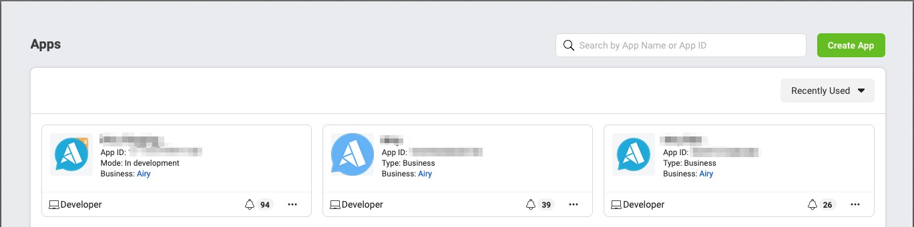
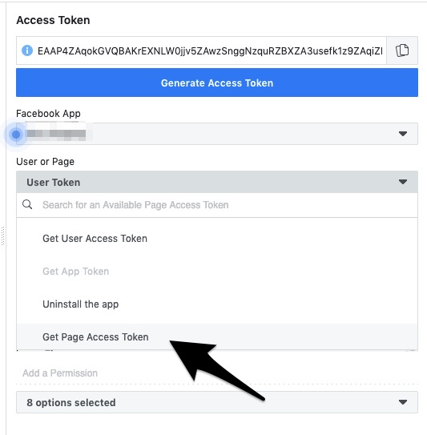

import useBaseUrl from '@docusaurus/useBaseUrl';

:::tip What you will learn
- How to connect Airy Core Platform to Facebook
:::

In the Airy Core Platform we consider Facebook to be a [Source](glossary.md#source),
meaning we can connect it to Airy using a [Channel](glossary.md#channel).

Facebook provides a mechanism that sends messages in a structured format to your local Airy instance.
For us to take advantage of this, we need to connect a local ran instance of Airy to a Facebook App.
The connection between those two parts is a connected channel. See [Channel](glossary.md#channel)

:::note Prerequisites
- A running Airy Core Platform installation [[Get Started](index.md#bootstrapping-the-airy-core-platform)]
- An approved Facebook App. [[Facebook Apps](https://developers.facebook.com/apps/)]
:::

This guide covers how to connect your Facebook Source so that it can use the
Airy Core Platform to send and receive messages.

## Connecting a Facebook Page

To connect a page, the first requirement is to have an approved app by Facebook. If you don't have one, you will need to create it.
After creating it, and Facebook approves it you should see it in https://developers.facebook.com/apps/

The `App Id` information is the first step that you should store. This will be used to connect your channel later on.
Next step is to obtain a page token, so Airy can send messages on behalf of your page. Fastest way to get one is to use the graph explorer that
Facebook provides 

On the `User or Page` option, select `Get Page Token` and click on `Generate Access Token`. Use this token to connect your page to Airy.

## Connecting a channel

Please refer to [[Source](/sources/facebook.md#connecting-a-channel)]
