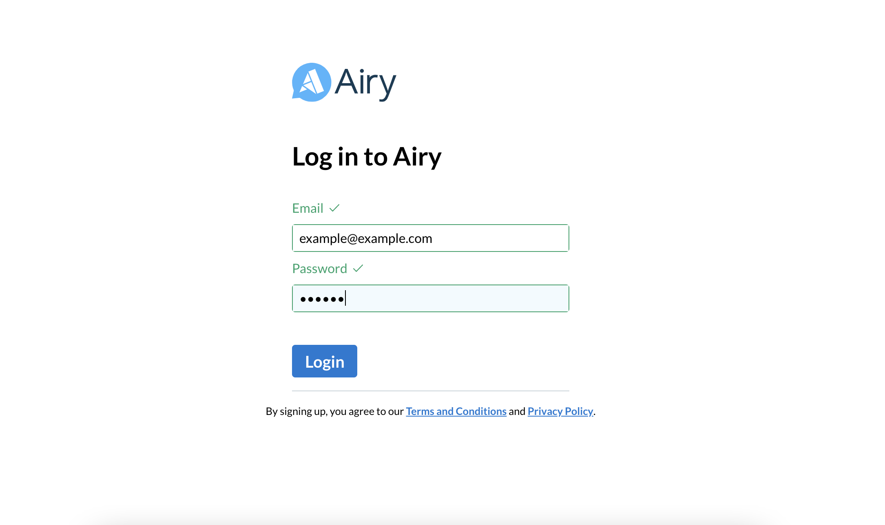

<p align="center">
    
    </a>
</p>


### Airy Demo UI

The Airy Demo UI is a minimal user interactive frontend project that showcases the Airy Core Platform API.It enables users to experience the functionalities of our Airy Core Platform.


- [Prerequities](#prerequities)
- [Building Airy Demo UI](#building-airy-demo-ui)
- [Installation](#installation)
- [Authentication](#authentication)
- [Endpoints](#endpoints)
- [How to contribute](#how-to-contribute)
- [Code of Conduct](#code-of-conduct)

### Prerequisites

* [Node.js](https://nodejs.org/) version 10 or newer
* [Git](https://www.atlassian.com/git/tutorials/install-git/) for your platform
* [Bazel](https://docs.bazel.build/versions/3.7.0/install.html) for building and testing the app


### Building Airy Demo UI

You can run the Airy Demo UI locally by running the following commands:

```
$ git clone https://github.com/airyhq/airy
$ cd airy
$ AIRY_VERSION=beta ./scripts/bootstrap.sh (Takes a few minutes)
```
When the bootstrap process finishes, open another terminal and run ``` $ ibazel run //frontend/demo:bundle_server ```
Then open `http://localhost:8080/` in a web browser to access the Airy Demo UI

### Installation
The bootstrap installation requires [Vagrant](https://www.vagrantup.com/downloads) and [VirtualBox](https://www.virtualbox.org/wiki/Downloads). If they are not
found, the script ```$ AIRY_VERSION=beta ./scripts/bootstrap.sh``` will attempt to install them for you. Check out our [test deployment guide](/docs/docs/guides/airy-core-in-test-env.md) for detailed information.

### Authentication

In order to communicate with our API endpoints, you need a valid [JWT](https://jwt.io/) token. To get a valid token you first need to signup using the signup [endpoint](#endpoints) and then login using the login [endpoint](#endpoints).

### Endpoints
   To communicate with our signup endpoint and register your email, open another terminal and type in the terminal ```curl -X POST -H 'Content-Type: application/json' -d '{"first_name": "your_name","last_name": "your_last_name","password": "your_password","email": "your_email@airy.co"}' http://api.airy/users.signup```

   To sign in, type in the terminal ```token=$(echo $(curl -H 'Content-Type: application/json' -d \"{ \\"email\":\"kazeem@airy.co\",\\"password\":\"test1234\" \}" api.airy/users.login) | jq -r '.token')```

Aside from Curl, [PostMan](https://www.postman.com/downloads/) and other API testing tools could also be used to access the endpoints.


### How To Contribute

We welcome (and love) every form of contribution! Good entry points to the
project are:

- Our [contributing guide](/docs/docs/guides/contributing.md)
- Issues with the tag
  [gardening](https://github.com/airyhq/airy/issues?q=is%3Aissue+is%3Aopen+label%3Agardening)
- Issues with the tag [good first
  patch](https://github.com/airyhq/airy/issues?q=is%3Aissue+is%3Aopen+label%3A%22good+first+patch%22)

If you're still not sure where to start, open a [new
issue](https://github.com/airyhq/airy/issues/new) and we'll gladly help you get
started.

### Code of Conduct

To ensure a safe experience and a welcoming community, the Airy Core Platform
project adheres to the [contributor
convenant](https://www.contributor-covenant.org/) [code of
conduct](/code_of_conduct.md).
